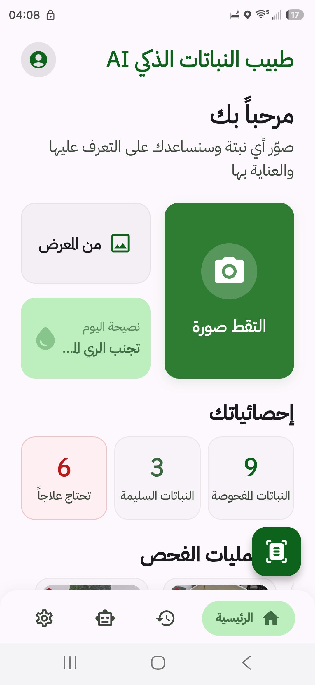
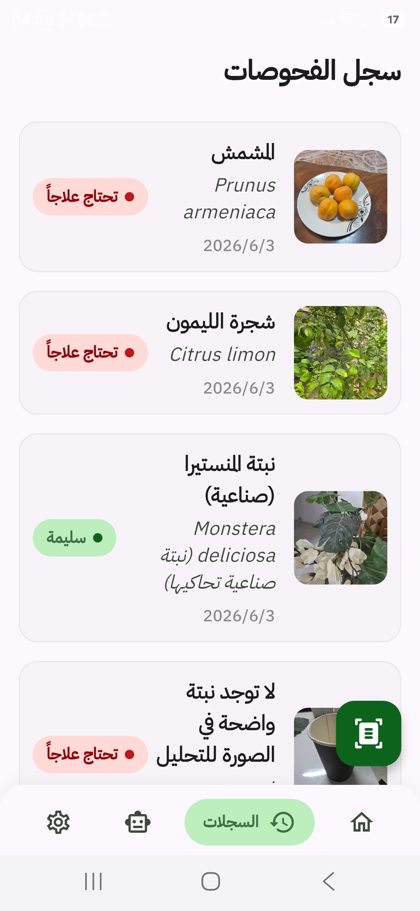
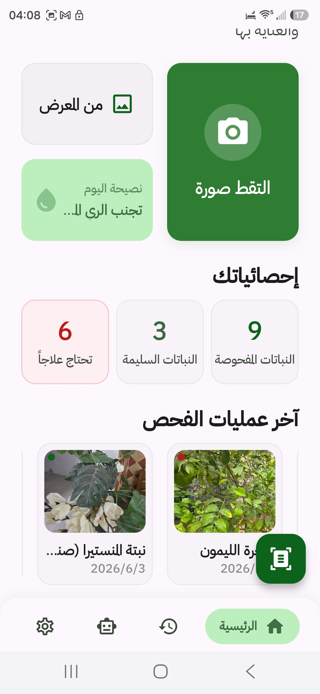
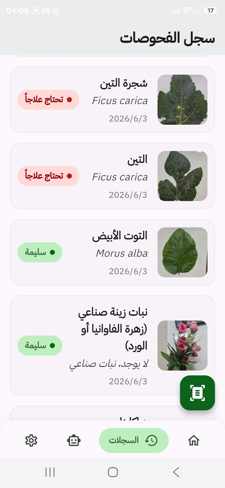
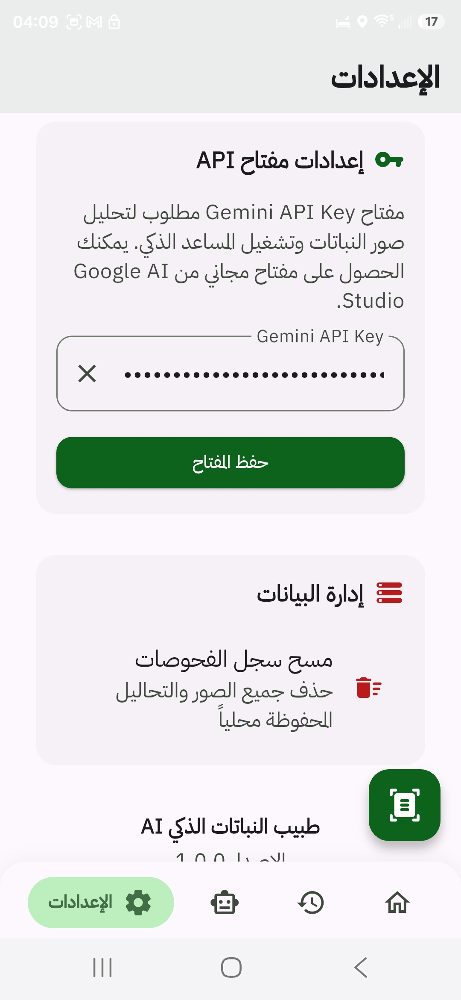
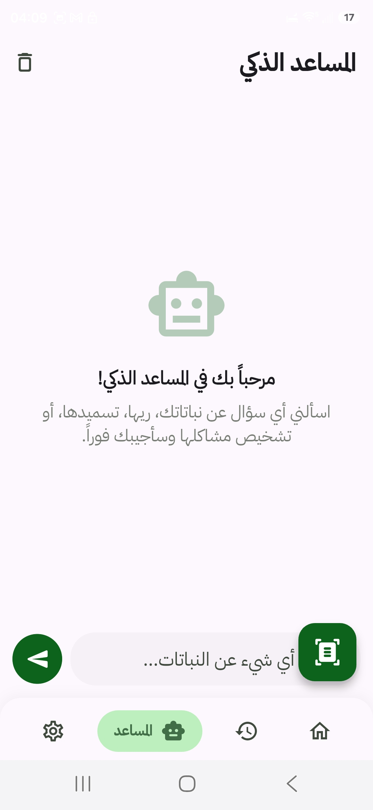
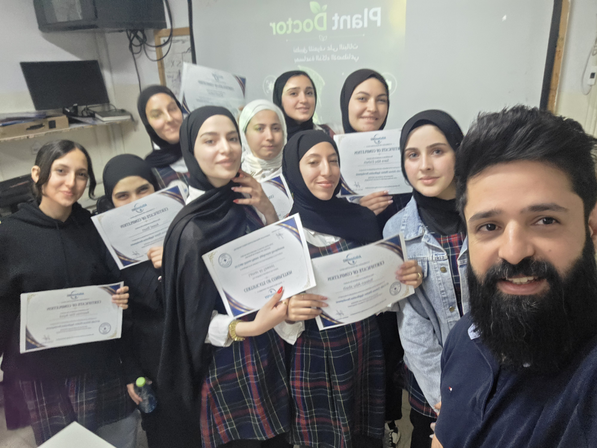
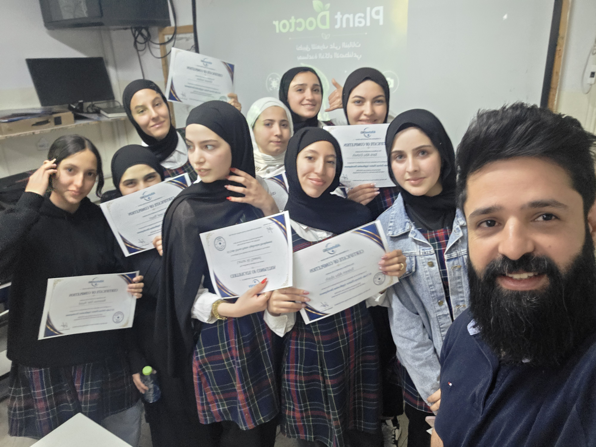

# 🌱 Rowad-PlantDoctor-AI (طبيب النباتات الذكي)

هذا المشروع هو تطبيق ذكي صُمم بواسطة طالبات مدرسة "رواد العلم" (فلسطين - القدس - كفر عقب - أم الشرايط). يهدف التطبيق إلى مساعدة المزارعين ومحبي النباتات على تشخيص الأمراض النباتية بسهولة باستخدام الذكاء الاصطناعي، ويقدّم حلولاً ونصائح سريعة للمحافظة على صحة النبات.

تمت رعاية هذا المشروع ودعمه من قبل مؤسسة **Aischool360**.

## 💡 ما هو المشروع؟
مشروع "طبيب النباتات الذكي" هو تطبيق هواتف ذكية (مبني بـ Flutter) يتيح للمستخدم التقاط أو رفع صورة لنبتة مصابة، ليقوم التطبيق فوراً بتحليل الصورة وتحديد المرض أو المشكلة التي تعاني منها النبتة، بالإضافة إلى اقتراح طرق العلاج المناسبة. الهدف التعليمي للمشروع هو دمج تقنيات الذكاء الاصطناعي الحديثة في حلول عملية تخدم البيئة والمجتمع.

## ⚙️ كيف يعمل المشروع؟
1. **التقاط/رفع الصورة**: يقوم المستخدم بالتقاط صورة لورقة النبتة المتضررة باستخدام كاميرا الهاتف أو رفعها من المعرض.
2. **تحليل الذكاء الاصطناعي**: تُرسل الصورة إلى واجهة برمجة تطبيقات (API) مخصصة للذكاء الاصطناعي.
3. **التشخيص والعلاج**: يقوم النموذج المدرب بتحليل الصورة وإرجاع التشخيص الدقيق (اسم المرض) مع خطوات العلاج المقترحة، وتُعرض النتيجة للمستخدم بطريقة سهلة ومبسطة.

## 🚀 التقنيات المستخدمة
- **Flutter**: لبناء واجهة المستخدم وتطوير التطبيق ليعمل على أنظمة متعددة.
- **Google Stitch**: أداة تصميم واجهات تعتمد على الذكاء الاصطناعي (AI UI design tool) لتصميم شاشات التطبيق بشكل عصري.
- **Gemini API**: نموذج الذكاء الاصطناعي الأساسي لمعالجة الصور وفهم وتوليد النصوص التشخيصية والعلاجية.
- **Dart**: لغة البرمجة الأساسية في المشروع.

## 📸 لقطات الشاشة (Screenshots)

### واجهة التطبيق

*الشاشة الرئيسية للتطبيق.*


*شاشة رفع الصورة وبدء التشخيص.*


*عرض النتيجة بعد تحليل الصورة وعرض طرق العلاج.*

### التجارب والاختبارات



*تجارب اختبار التطبيق ونموذج الذكاء الاصطناعي.*


*تجارب إضافية لآلية العمل.*

### صورة الفريق

*صورة جماعية للفريق الرائع خلف هذا المشروع!*

## 💻 كيفية التشغيل (التثبيت محلياً)

1. **نسخ المستودع**:
   ```bash
   git clone https://github.com/YourOrganization/Rowad-PlantDoctor-AI.git
   cd Rowad-PlantDoctor-AI
   ```
2. **تثبيت الحزم (Dependencies)**:
   ```bash
   flutter pub get
   ```
3. **إعداد مفتاح Gemini API**:
   - احصل على مفتاح API من [Google AI Studio](https://aistudio.google.com/).
   - انسخ ملف `.env.example` إلى ملف جديد باسم `.env`.
   - ضع مفتاحك في ملف `.env` بالشكل التالي:
     ```
     GEMINI_API_KEY=your_actual_api_key_here
     ```
4. **تشغيل التطبيق**:
   ```bash
   flutter run
   ```

## 👥 الفريق والشكر والتقدير

- **الطالبات (المطوّرات - Authors):**
  - [@lamaroabd-oss](https://github.com/lamaroabd-oss)
  - [@aseeldesna-coder](https://github.com/aseeldesna-coder)
  - [@sara2najeho](https://github.com/sara2najeho)
  - [@ghaz](https://github.com/soltanghazal59-debug/ghaz)
  - [@remasayyad932-sudo](https://github.com/remasayyad932-sudo)
  - [@noormohamad17](https://github.com/noormohamad17)
  - [@toleenabusbeih-dotcom](https://github.com/toleenabusbeih-dotcom)
  - [@fshweiki171-netizen](https://github.com/fshweiki171-netizen)

- **المشرف والمدرب ومُعد المادة (Supervisor & Trainer):**
  - **Ahmad Zayed (أحمد زايد)** (مؤسس شركة [Atlahub](https://atlahub.tech/))

- **المعلمة المشرفة (Academic Co-Advisor):**
  - **[اسم المعلمة]**

شكر خاص لمؤسسة **Aischool360** لرعايتها الكريمة لهذا المشروع. كما نتقدم بالشكر لـ Google Stitch و Gemini API لمساهمتهم في تسهيل وتسريع عملية التطوير والتصميم.

## 📄 الترخيص (License)
هذا المشروع متاح للاستخدامات **التعليمية وغير التجارية فقط**. يُمنع الاستخدام التجاري نهائياً بدون إذن خطي مسبق. لمزيد من التفاصيل حول حقوق الاستخدام، يرجى الاطلاع على ملف [LICENSE.md](./LICENSE.md).

## 📞 التواصل
للاستفسارات التقنية أو بخصوص الأذونات، يمكنكم التواصل مع المشرف:
- البريد الإلكتروني: azayed@atlahub.tech
